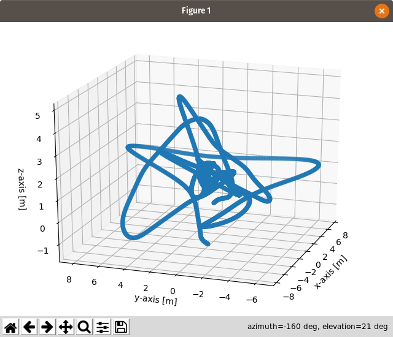

### 2018-05-08
#### May 8, 2018

Alright, updates since last log entry:
- First, I think the new locus setup is looking decent. This is the output from
  an offline program, which is going to get ported into nav_and_whimsy.

  
  [//]: # (here's pure markdown, but image size is a little large )

  That being said, right now the 'stable' behavior is pretty time-dependent.
  After a while, the average distance error gets greater and greater. In terms
  of a 2D dynamical system, it ends up looking globally like an unstable focus.
  It's also possible the local stability is essentially coincidental; I'm
  unconvinced by the current logic in determine_quadrant() and calculate_yaw().
  In particular, I think the current methodology for making yaw act continuously
  and choosing the shortest turn radius is not built very well, so that's going
  to be an area of focus moving forward.

  Also, the waypoints are now plotted. They're set up so that as each one is
  being searched for, it appears in the waypoints.csv file. As result,in this
  current iteration, if it hasn't been looked for yet, it won't appear.   
